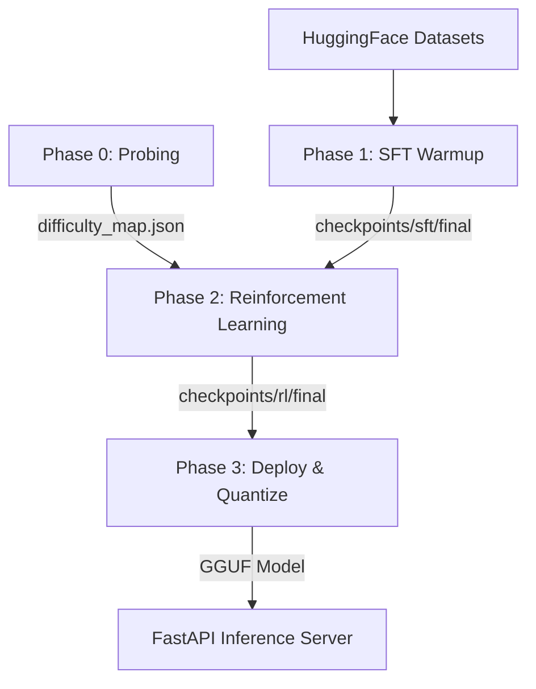

# Architecture

## Navigation
- [Main README](../README.md)
- [Technical Stack](technical_stack.md)
- [Architecture](architecture.md)
- [Implementation Details](implementation_details.md)
- [Installation Guide](installation.md)
- [User Guide](user_guide.md)
- [Features](features.md)
- [Benchmark Results](benchmark_results.md)
- [API Reference](api_reference.md)
- [Agentic AI Development (ax.md)](ax.md)

---

## System Overview
CRAFT (Curriculum-guided Reinforced Adaptive Fine-Tuning) is an end-to-end framework designed to align Small Language Models (SLMs) for complex step-by-step reasoning tasks. CRAFT enables consumer-grade hardware (such as 2x24GB GPUs) to optimize models like Phi-3-Mini (3.8B) and Qwen-2.5 (7B) to solve mathematical and logical problems while maintaining structural response formatting.

The framework consists of four sequential execution phases:
1. **Phase 0 (Capability Probe):** Diagnoses base model capabilities across multiple datasets to map question difficulties.
2. **Phase 1 (SFT Warmup):** Standardizes formatting by training a format-compliance adapter.
3. **Phase 2 (Reinforcement Learning):** Optimizes reasoning depth using token-efficient Group Relative Policy Optimization (GRPO) coupled with step-level Direct Preference Optimization (DPO).
4. **Phase 3 (Deploy & Quantize):** Quantizes aligned weights into GGUF files for lightweight on-device serving.

---

## Pipeline Diagram

<!-- SCREENSHOT NEEDED: Full Phase 0→1→2→3 pipeline diagram.
     Use the existing architecture diagram generated earlier in the project,
     or regenerate from src/craft_pipeline.py structure. -->

---

## Phase-by-Phase Breakdown

### 1. Phase 0 — Capability Probe
* **Purpose:** Map the capability of the base model on a mixed-difficulty set of mathematical and reasoning problems.
* **Input:** Raw HuggingFace datasets (GSM8K, AQuA-RAT, StrategyQA, MMLU) sampled uniformly.
* **Output:** `Outputs/difficulty_map.json` containing difficulty scores for each question.
* **Key Implementation File:** [`probe.py`](file:///home/vishal/Projects/CRAFT/CRAFT-SLM-Reasoning-Framework-Qwen25/craft/phase0_probe/probe.py) and [`difficulty_mapper.py`](file:///home/vishal/Projects/CRAFT/CRAFT-SLM-Reasoning-Framework-Qwen25/craft/phase0_probe/difficulty_mapper.py)
* **Execution Logic:** For each question, the model generates $k=5$ response traces at a temperature of $0.8$. The correctness of each trace is validated against the ground truth. The difficulty score is calculated as:
  $$\text{Difficulty} = 1.0 - \frac{\text{Correct Count}}{k}$$
  Questions are saved with their prompt, ground-truth answer, and difficulty score to construct the initial pool.

### 2. Phase 1 — Supervised Fine-Tuning (SFT) Warmup
* **Purpose:** Inject format compliance (forcing the model to use `<thought>`, `<answer>`, step-by-step markers, and structured final answers) and align prompt styles.
* **Input:** Raw training datasets processed into step-by-step formatting templates.
* **Output:** LoRA adapter checkpoints saved in `checkpoints/sft/final`.
* **Key Implementation File:** [`train_sft.py`](file:///home/vishal/Projects/CRAFT/CRAFT-SLM-Reasoning-Framework-Qwen25/craft/phase1_sft/train_sft.py) and [`data_loader.py`](file:///home/vishal/Projects/CRAFT/CRAFT-SLM-Reasoning-Framework-Qwen25/craft/phase1_sft/data_loader.py)
* **Execution Logic:** Loads base model in 4-bit, maps target answers into explicit step blocks (e.g. `Step 1: ... \nStep 2: ... \nFinal Answer: [value]`), and trains a Peft/LoRA model via HuggingFace's `SFTTrainer` for 1-3 epochs.

### 3. Phase 2 — Reinforcement Learning (RL) Alignment
* **Purpose:** Learn deep, logical reasoning paths while correcting step-level errors on the fly.
* **Input:** Final SFT warmup checkpoint (`checkpoints/sft/final`) and `difficulty_map.json`.
* **Output:** Aligned model checkpoints under `checkpoints/rl/` (with final model in `checkpoints/rl/final`).
* **Key Implementation File:** [`craft_rl_loop.py`](file:///home/vishal/Projects/CRAFT/CRAFT-SLM-Reasoning-Framework-Qwen25/craft/phase2_rl/craft_rl_loop.py)
* **Execution Logic:** Merges group-relative reward signals (GRPO) with step-level contrastive alignment (DPO) and dynamic curriculum sampling. In each iteration:
  1. A question is sampled from the active curriculum pool.
  2. The policy model generates a group of $G=4$ (or $8$) response candidates.
  3. The candidates are evaluated by the Reward Scorer (Component A) to compute advantages.
  4. Discrepancies between reasoning steps are parsed and trained using Step DPO (Component B).
  5. The active difficulty bounds are adjusted based on accuracy (Component C).

### 4. Phase 3 — Deploy & Quantize
* **Purpose:** Prepare the model for low-latency, CPU-friendly local on-device serving.
* **Input:** Aligned RL LoRA adapter weights (`checkpoints/rl/final`).
* **Output:** Unified GGUF model files (`craft_output/CRAFT_Q4_K_M.gguf`).
* **Key Implementation File:** [`quantizer.py`](file:///home/vishal/Projects/CRAFT/CRAFT-SLM-Reasoning-Framework-Qwen25/craft/phase3_deploy/quantizer.py) and [`packager.py`](file:///home/vishal/Projects/CRAFT/CRAFT-SLM-Reasoning-Framework-Qwen25/craft/phase3_deploy/packager.py)
* **Execution Logic:** Merges the LoRA adapter weights back into the FP16 base model, saves the combined HuggingFace weights, and runs the `llama.cpp` conversion tool followed by quantization to GGUF using the `Q4_K_M` structure.

---

## Component Deep Dive

### Component A: Step-Level Execution & Verification (Reward Scorer)
* **Class Names:** `RewardScorer` & `ExecutionVerifier` ([`reward_scorer.py`](file:///home/vishal/Projects/CRAFT/CRAFT-SLM-Reasoning-Framework-Qwen25/craft/phase2_rl/component_a/reward_scorer.py), [`execution_verifier.py`](file:///home/vishal/Projects/CRAFT/CRAFT-SLM-Reasoning-Framework-Qwen25/craft/phase2_rl/component_a/execution_verifier.py))
* **Function Names:** `score_with_success()`, `score_steps()`, `verify_step_arithmetic()`, `verify_logical_consistency()`
* **Detailed Formula & Logic:**
  Rather than using an unstable LLM-as-a-judge critic, Component A calculates a deterministic reward $R_A$:
  $$R_A = 0.4 \times R_{\text{correct}} + 0.6 \times R_{\text{step}}$$
  * **Final Answer Reward ($R_{\text{correct}}$):** Binary $1.0$ if the extracted final answer matches the ground truth (using string equivalence or float range parsing), else $0.0$.
  * **Step-Level Execution Reward ($R_{\text{step}}$):** Evaluated by parsing individual steps. For each step containing mathematical expressions (e.g., $A + B = C$), the equations are evaluated programmatically using `verify_step_arithmetic()`. The ratio of correct equations to total checkable equations is calculated.
  * **Logical Consistency:** If a step does not contain checkable math, logical consistency is measured as the overlap of numbers. If numbers in the current step appear in previous steps, it scores $0.7$ (meaning progress is derived from prior facts), if zero overlap it scores $0.3$, otherwise $0.5$ (default).
  * **Formatting Bonus:** If `<thought>` and `<answer>` XML-style boundary blocks are correctly structured, $R_A$ receives a $+0.05$ format compliance bonus (clamped at $1.0$).

### Component B: Step-Level Contrastive Alignment
* **Class Names:** `ContrastiveBuilder` & `StepDPOTrainer` & `StepParser` ([`contrastive_builder.py`](file:///home/vishal/Projects/CRAFT/CRAFT-SLM-Reasoning-Framework-Qwen25/craft/phase2_rl/component_b/contrastive_builder.py), [`dpo_trainer.py`](file:///home/vishal/Projects/CRAFT/CRAFT-SLM-Reasoning-Framework-Qwen25/craft/phase2_rl/component_b/dpo_trainer.py))
* **Function Names:** `build_pairs()`, `compute_dpo_loss()`, `compute_loss()`
* **Detailed Logic:**
  1. For each group of generated answers, `StepParser` extracts the step-by-step chains.
  2. `ContrastiveBuilder` compares all trace combinations to locate the exact step index where their mathematical execution correctness diverges (i.e. where step reward $R_i = 1.0$ on one path but $R_i = 0.0$ on the other path, while all previous steps $1 \dots i-1$ are identical).
  3. A contrastive pair is built: the prompt context contains all steps up to $i-1$, the "chosen" completion is the correct step $i$, and the "rejected" completion is the incorrect step $i$.
  4. The model is optimized using step-level DPO loss (clamped with KL penalties against the reference SFT model):
     $$\mathcal{L}_{\text{DPO}} = -\log \sigma \left( \beta \left( (\log \pi_\theta(y_w \mid x, \text{prev}) - \log \pi_\theta(y_l \mid x, \text{prev})) - (\log \pi_{\text{ref}}(y_w \mid x, \text{prev}) - \log \pi_{\text{ref}}(y_l \mid x, \text{prev})) \right) \right)$$

### Component C: Live Adaptive Curriculum
* **Class Names:** `CurriculumEngine`, `KLController`, `AccuracyTracker` ([`curriculum_engine.py`](file:///home/vishal/Projects/CRAFT/CRAFT-SLM-Reasoning-Framework-Qwen25/craft/phase2_rl/component_c/curriculum_engine.py), [`kl_controller.py`](file:///home/vishal/Projects/CRAFT/CRAFT-SLM-Reasoning-Framework-Qwen25/craft/phase2_rl/component_c/kl_controller.py))
* **Function Names:** `update_accuracy()`, `step()`, `get_active_pool()`, `get_beta()`
* **Detailed Logic:**
  * **Curriculum Engine:** Maintains active difficulty limits `[min_difficulty, max_difficulty]` (initialized at `[0.4, 0.7]`). The model only trains on questions whose Phase 0 difficulty falls within this window.
  * **Rolling Tracker:** Tracks model success rate over a sliding window of 50 samples. When rolling accuracy stabilizes above `stability_threshold` (0.7), the curriculum limits are expanded: `max_difficulty` increases by $+0.1$ and `min_difficulty` increases by $+0.05$ (capped at a ceiling of $0.85$ to prevent overfitting to hard outliers).
  * **KL Controller:** Dynamically scales the KL penalty coefficient (`beta`) to stay close to a target divergence of $0.1$. If the recent average KL exceeds $0.15$, `beta` is scaled up by $1.02$; if below $0.05$, `beta` is scaled down by $0.98$ (clamped between $0.005$ and $0.2$).

---

## Data Flow Diagram

<!-- SCREENSHOT NEEDED: Diagram showing difficulty_map.json → SFT checkpoint
     → RL checkpoint → GGUF → benchmark results, with arrows. -->

---

## Screenshot Checklist

The following is a list of screenshots and figures that must be captured by a human before final framework submission:

- [ ] `screenshots/architecture_diagram.png` — Full pipeline block diagram showing Phases 0, 1, 2, and 3.
- [ ] `screenshots/data_flow.png` — Data flow graph tracing prompt datasets $\rightarrow$ difficulty maps $\rightarrow$ training steps $\rightarrow$ final evaluations.
- [ ] `screenshots/installation_success.png` — Terminal printout showing the successful execution of the command-line doctor suite.
- [ ] `screenshots/ui_dashboard.png` — Main web interface layout showing side-by-side responses for baseline and CRAFT-aligned models.
- [ ] `screenshots/ui_inference_example.png` — Detailed zoom of step-by-step reasoning outputs with formatting blocks intact.
- [ ] `screenshots/benchmark_comparison.png` — Graphic comparison chart demonstrating baseline vs SFT vs CRAFT accuracies on MMLU, GSM8K, and StrategyQA.
