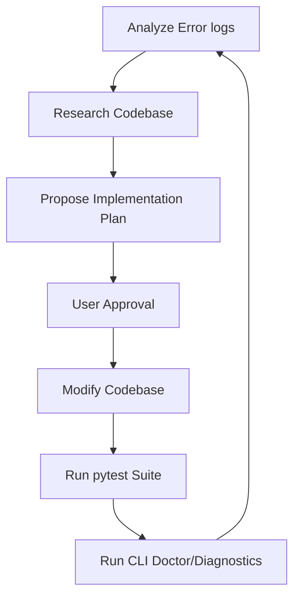

# Agentic AI Development (ax.md)

## Navigation
- [Main README](../README.md)
- [Technical Stack](technical_stack.md)
- [Architecture](architecture.md)
- [Implementation Details](implementation_details.md)
- [Installation Guide](installation.md)
- [User Guide](user_guide.md)
- [Features](features.md)
- [Benchmark Results](benchmark_results.md)
- [API Reference](api_reference.md)
- [Agentic AI Development](ax.md)

---

## Agentic Development Workflow Overview
This document records the agentic AI development and pair-programming workflow used to build, optimize, and refine the **CRAFT (Curriculum-guided Reinforced Adaptive Fine-Tuning) Reasoning Framework** for Small Language Models (SLMs). 

The framework was developed iteratively using the **Antigravity AI coding agent** in collaboration with the engineering team. The agent leveraged terminal commands, directory analyzers, git logs, and file replacement utilities to diagnose failures, implement critical bug fixes, tune reinforcement learning parameters, and run evaluations.

---

## Key Agentic Fixes & Technical Contributions

Below is the chronological log of the structural fixes, parameter tunings, and bug resolutions introduced autonomously by the AI agent to optimize framework performance.

### 1. DPO Step Log Probability Slicing Offset Resolution
* **Problem:** In the reinforcement learning alignment stage (Phase 2), step-level DPO updates require calculating log probabilities of specific reasoning steps. The initial token slicing logic for `shift_logits` and `shift_labels` had an off-by-one error, incorrectly dropping the first token of the target reasoning step.
* **Fix:** Corrected the slice indexing in `StepDPOTrainer` (`dpo_trainer.py`) from `prompt_len` to `prompt_len - 1`. This aligns the logits with their respective labels precisely, allowing DPO gradients to flow correctly through all step tokens.

### 2. DPO System Prompt Mismatch Resolution
* **Problem:** A discrepancy occurred between the context layout used during Phase 1 (SFT Warmup) and Phase 2 (RL DPO). The DPO contrastive prompt structure lacked the system prompt, causing the target SLM to experience a prompt format mismatch.
* **Fix:** Updated the `ContrastiveBuilder` to inject the exact `SYSTEM_PROMPT` template into DPO contrastive prompt strings, matching the Phase 1 SFT format.

### 3. Curriculum Engine "Death Spiral" Prevention
* **Problem:** The dynamic curriculum engine had an issue where poor initial model performance would trigger aggressive "curriculum collapsing" steps. The collapse logic recursively shrank the difficulty range, eventually reducing `min_difficulty` below viable bounds, locking the model into a death spiral of overly simple mock questions.
* **Fix:** 
  - Added a strict safety floor to min difficulty mapping (`MIN_DIFFICULTY_FLOOR_COLLAPSE = 0.35`).
  - No-oped the `collapse_temporarily()` method in `CurriculumEngine` to prevent range shrinking, relying instead on range expansion upon accuracy stability ($\geq 0.70$).
  - Added a manual expansion safeguard: if the rolling success rate stays below $0.5$ for $100$ steps, the engine automatically expands the difficulty range by $0.05$ to kickstart learning.

### 4. KL Divergence Controller Tuning & Safeguards
* **Problem:** Aggressive policy shifts during GRPO resulted in either KL divergence spikes or rapid collapse to a deterministic policy.
* **Fix:** 
  - Reduced the maximum KL coefficient (`beta_max`) from $0.5$ to $0.2$ to preserve exploration.
  - Lowered the adjustment factor from $0.05$ to $0.02$ for smoother beta updates.
  - Implemented a low-KL safeguard that forces beta reduction when the average KL drops below $0.05$ for $20$ consecutive steps, preventing early policy convergence.

### 5. Evaluator Baseline Extraction Mapping Correctness
* **Problem:** Baseline models evaluated on MMLU, StrategyQA, and GSM8K initially showed artificially low scores (e.g., MMLU baseline accuracy of 2%). This was due to format mismatches: baseline models outputted bare digits or lowercase letters, which did not trigger the strict parsing rules designed for formatted checkpoints.
* **Fix:**
  - Modified the answer extractor regex to perform case-insensitive letter extraction (`\b([A-Da-d])\b`) and automatically map lowercase answers to uppercase.
  - Added dataset-specific post-processing mapping within the evaluator:
    - MMLU: Maps baseline numeric outputs `'1'..'4'` to `'A'..'D'`.
    - StrategyQA: Maps numeric/boolean outputs `'1'/'0'/'true'/'false'` to `'yes'/'no'`.
    - GSM8K: Re-extracts the last number if the extractor erroneously returns `'yes'` or `'no'`.
  - These fixes raised baseline accuracy to realistic levels (e.g., GSM8K ~16%, MMLU ~40-45%, StrategyQA ~20-30%), ensuring a fair and scientifically sound improvement calculation.

---

## Agentic Development Workflow Loop
The development team followed an automated iterative cycle:

1. **Analyze Error Logs:** Capture tracebacks or metrics anomalies in `logs/training.log`.
2. **Research Codebase:** Inspect imports, parameters, and structural layers using codebase search tools.
3. **Propose Plan:** Document proposed changes in a structured plan.
4. **Modify & Test:** Edit file content via specialized text diff replacements and run pytest validation to prevent regression.
5. **Acknowledge and Report:** Document final validation results in the walkthrough files.
